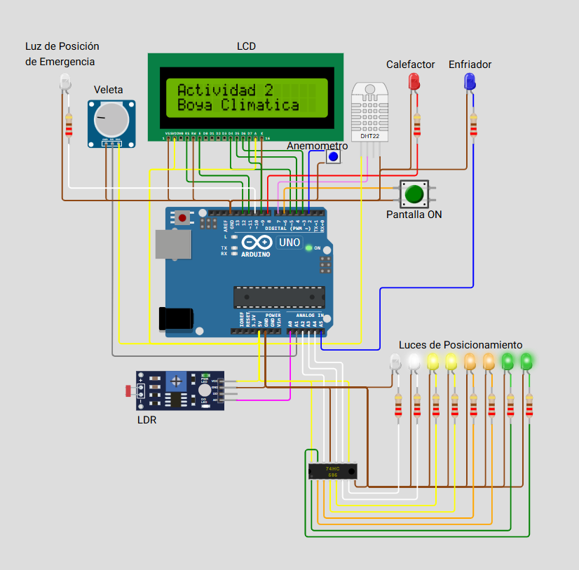

# Boya Climática Inteligente
Autor: Gonzalo Torán Mosulén



## Descripción del proyecto

Este proyecto simula una boya meteorológica autónoma, capaz de medir condiciones ambientales como temperatura, humedad, viento y luz solar. Además, simula una batería que se recarga con energía solar y consume energía dependiendo de los componentes en uso (los parametros asignados a los niveles de gasto, carga y capacidad de la bateria han sido calculados para permitir una autonomia considerable durante la noche y varios dias de poca luz). 

Tiene 4 modos de funcionamiento diferente en funcion del ahorro de energia que se quiera lograr, estos estados son adpoptados por la boya de forma automática en funcion de factores como, nivel de Bateria, capacidad de carga (factores de inhabilitacion de la carga o nivel de luz exterior que alimenta la bateria a traves del panel solar simulado. Está implementado sobre Arduino UNO y diseñado en el entorno de simulación Wokwi.

Enlace al proyecto: https://wokwi.com/projects/432357065938941953

## Componentes utilizados

- Arduino Uno
- Sensor DHT22 (temperatura y humedad)
- Sensor LDR (luz)
- Potenciómetro (veleta - dirección del viento)
- Pulsador (anemómetro - velocidad del viento)
- LCD 16x2
- LED rojo (calefactor)
- LED azul (enfriador)
- LED blanco (luz de emergencia)
- 74HC595 (registro de desplazamiento)
- LEDs de posición (se encienden mas cuanto menos luz externa se detecta)
- Botón de usuario (Encender la pantalla entre 1-4s fuera del modo estandar).

## Funcionalidades

- Lectura de sensores: temperatura, humedad, luz, viento (dirección y velocidad).
- Control de actuadores según condiciones climáticas.
- Gestión de batería simulada, incluyendo carga y descarga.
- Modo estandar: pantalla funcionando todo el tiempo.
- Modo de ahorro de energía: pantalla apagada cuando no se necesita.
- Modo ultra-ahorro de energia: pantalla se enciende muy brevemente para mostrar mensaje de bateria baja, no muestra medidas, solo luz posicionamiento de emergencia encendida.
- Modo inhabilitación bateria: calefactor/enfriador encendido, pantalla apagada cuando no se necesita, no muestra medidas mas que las de los cambios de temperatura de la bateria, el nivel de esta y los toiempos totales de uso del calefactor/refrigerador.
- Visualización de información relevante en una pantalla LCD.

## Fragmento de código representativo

```cpp
void controlTemperatura() {
  if (temperatura < limiteInferior) {
    digitalWrite(CALEFACTOR_PIN, HIGH);
    digitalWrite(ENFRIADOR_PIN, LOW);
    carga_On = false;
  } else if (temperatura > limiteSuperior) {
    digitalWrite(CALEFACTOR_PIN, LOW);
    digitalWrite(ENFRIADOR_PIN, HIGH);
    carga_On = false;
  } else {
    digitalWrite(CALEFACTOR_PIN, LOW);
    digitalWrite(ENFRIADOR_PIN, LOW);
    carga_On = true;
  }
}
```

## Estructura del repositorio

- `boya_climatica.ino`: Código fuente principal
- `diagram.json`: Esquema del circuito en Wokwi
- `libraries.txt`: Lista de librerias utilizadas en Wokwi
- `images/CircuitoActividad2.png`: Imagen del circuito
- `README.md`: Documentación del proyecto

## Cómo probarlo

1. Abrir el enlace de Wokwi.
2. Establecer una temperatura inicial a la bateria en el DHT22 (Temperatura inicial Bateria = Temperatura Exterior) y observa el comportamiento (Enfriador/Calefactor)
3. Cambiar la luz del LDR y observar el comportamiento (LEDs de Posicionamiento).
4. Usar el botón verde para activar la pantalla si fuera necesario (Modos Ahorro de Energia e inhabilitación bateria (cuando esta calentandose/enfiandose).
5. Gira el potenciómetro para cambiar la dirección del viento.
6. Pulsar el botón azul para simular ráfagas de viento.

## Conclusión

Este proyecto demuestra cómo una solución embebida puede integrarse con múltiples sensores y actuadores, gestionar su propio consumo energético y presentar información de forma clara al usuario. La simulación permite evaluar su comportamiento en condiciones variables.
